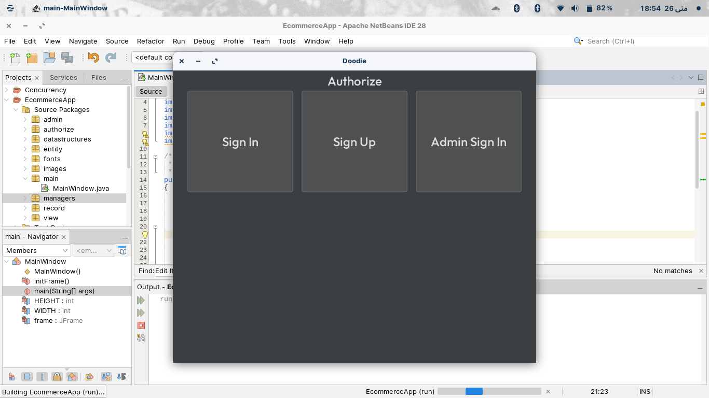
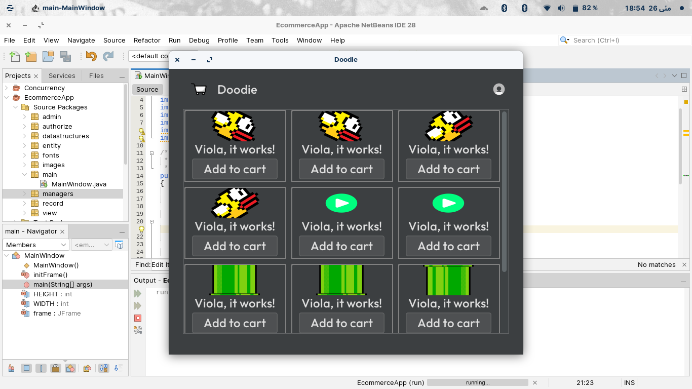
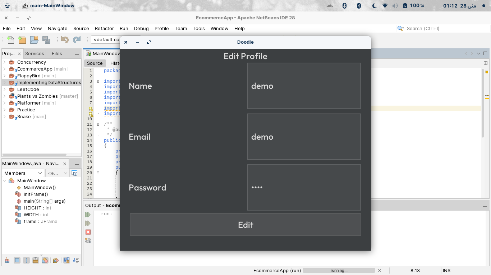
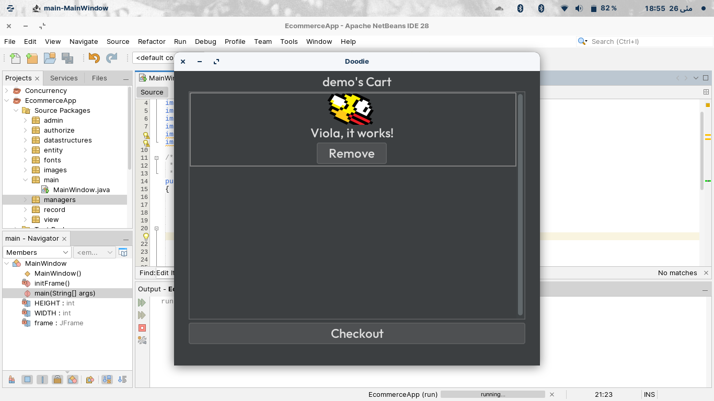
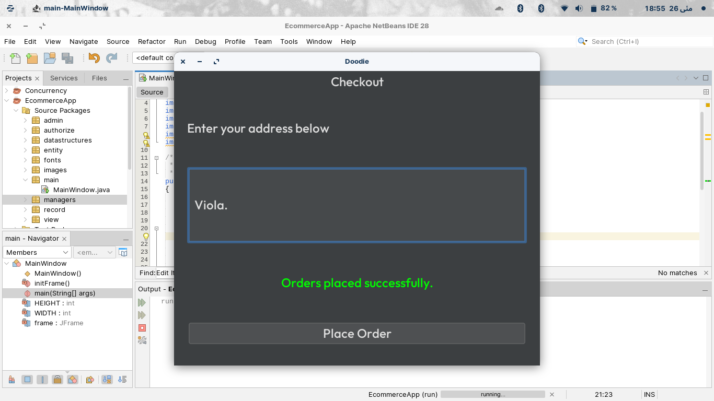
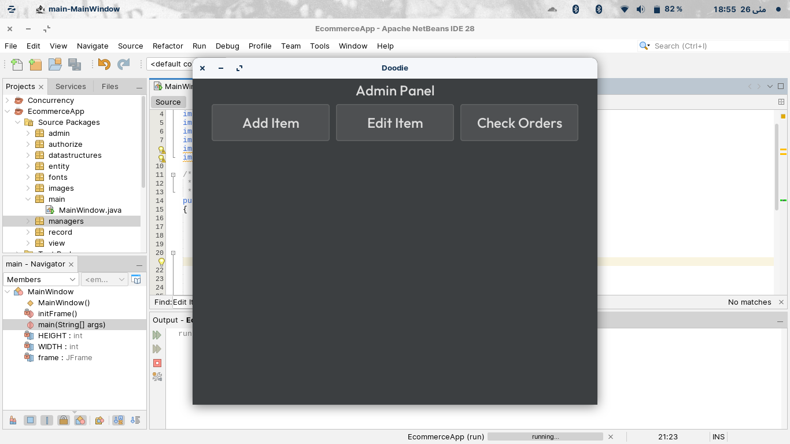
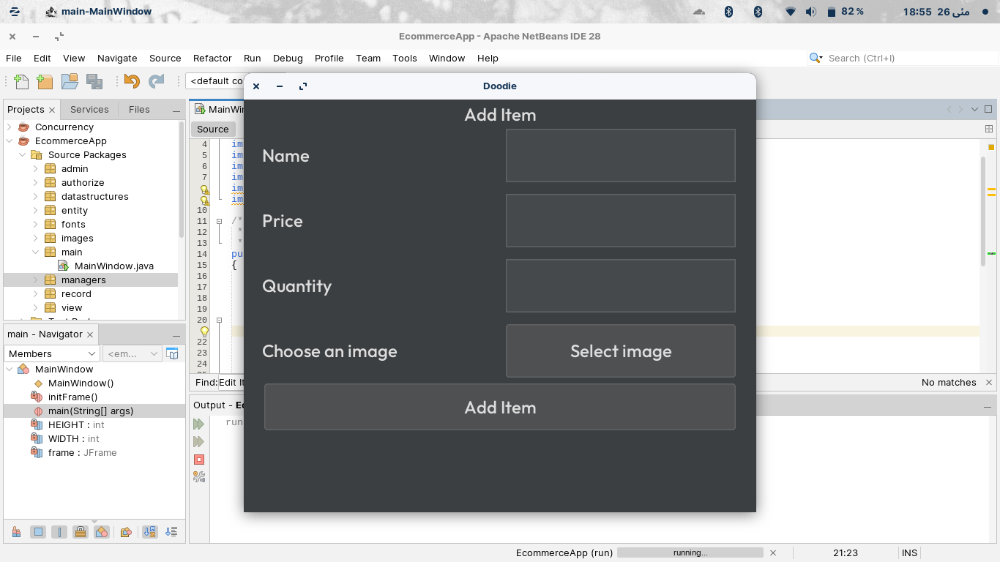
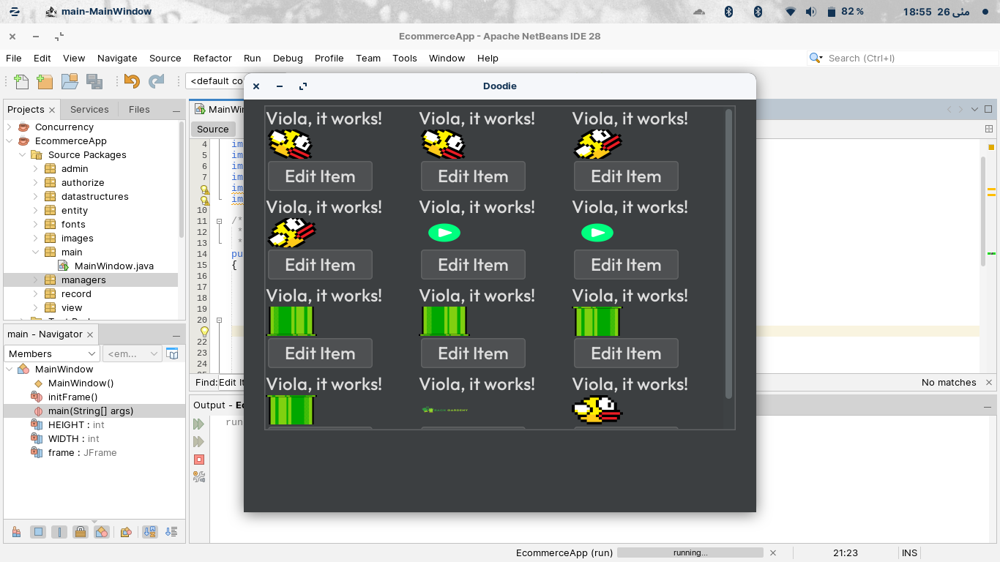

# Doodie
Doodie is a desktop e-commerce app built with **Java 17** and **Swing**. It provides user authentication, product browsing, cart and checkout flow, profile management, and admin tooling to manage items and review orders.
## Pages / Features
Below are the pages (panels essentially) available in Doodie.
### Authorization
The auth page gives the option to either sign up, sign in, or sign in as an admin. The user objects are serialized in a "users.ser" in "/record".
The default email and password for the admin sign in is: "demo". You can change it in "src/authorize/AdminSignIn.java"

### Home
The home panel displays all the item objects after fetching them from the "/record/items.ser" once the application is started. Each "ItemCard" has the "Add to Cart" option which adds the corresponding item to logged in user's cart.

### Profile
The login details of the current logged in user can be changed from the "Profile" panel.

### Cart
On the home page, the user can click the "Cart" icon to go to the "Cart" panel, which displays all the items in the logged in user's cart. The "CartItemCard" also has the remove button to remove the corresponding item from the user's cart.

### Checkout
Upon clicking the "Checkout" button on the Cart panel, the "Checkout" panel is shown, where you can enter the address of delivery and click the "Place Order" button. Upon clicking the "Place Order", a new order object will be created and serialized to the "/record/orders.ser".

### Admin Panel
After signing in as an admin, you can either add a new item, edit the existing ones, or check the current pending orders.

### Add an Item
The "Add Item" panel allows you to enter the name, price, quantity, and allows to select an ImageIcon for the item. Upon clicking the "Add Item", a new Item object is created and serialized to the "/record/items.ser".

### Edit Existing Items
You can also edit the existing Item objects from the "EditItem" panel. A list of the currently available items will be displayed, and upon clicking the "Edit Item" in any of the "Item Card", you will be diverted to the panel where you can change that item's name, price, quanity, or the ImageIcon. Upon saving, the Item object will be updated and serialized in the "/record/items.ser".

### Check Orders
Finally, you can check the orders currently pending in the "CheckOrders" panel. A list of the "unfulfilled" "Order" objects will be deserialized from the "/record/order.ser" and displayed. Each "OrderItem" contains the name, ImageIcon, and the address of the order. Upon clicking the "Set Fulfilled" button, the order object will be marked as 'fulfilled' and wouldn't appear the next tie you open the "CheckOrders" panel.
## It Uses the FlatLaf, Instead of the Default Swing Look and Feel
If you're merely copying the source code and not the whole repo, then make sure that you have the FlatLaf's .jar file in your project's dependencies.
You can also change the theme of the "Doodie" from Dark to Light (or any other for that matter) by changing the FlatLaf's theme at the very beginning of the main method (that is inside the main/MainWindow.java).
## How to Run?
Below are the methods to run this project.
### Manually Compile
1. Clone the repo
   
   ```git clone https://github.com/Shaheer-Zeb/doodie.git```

2. cd into "doodie/src"

   ```cd doodie/src```

3. Compile the classes

   ```javac main/MainWindow.java```

4. Run

   ```java main/MainWindow```

If you face any issues in manual compiling, consider running using another method.
### Run the .jar
The .jar file of the project is available in "/dist". However, I can't assure that it'd work perfectly for you either, because the way I load resources doesn't work with .jar files (namely, I didn't load resources like this, getClass().getResource(name)).
### Import into NetBeans and Run
As this project was supposed to be a NetBeans project, you can simply clone this repo, open the Ant project in NetBeans, and press "Run", you'd be golden.

**Note:** The ArrayList this project uses isn't the default one builtin to JCF (Java Collections Framework), but the one I created here in this repo of [Data Structures Implementation](https://github.com/Shaheer-Zeb/data-structures-implementation).
